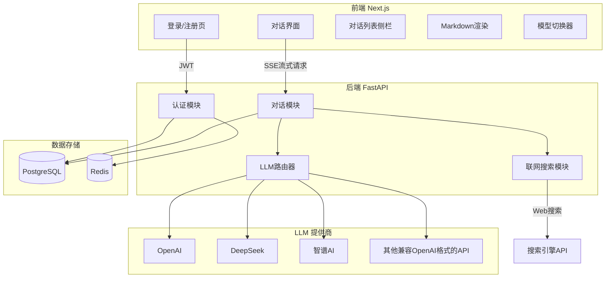
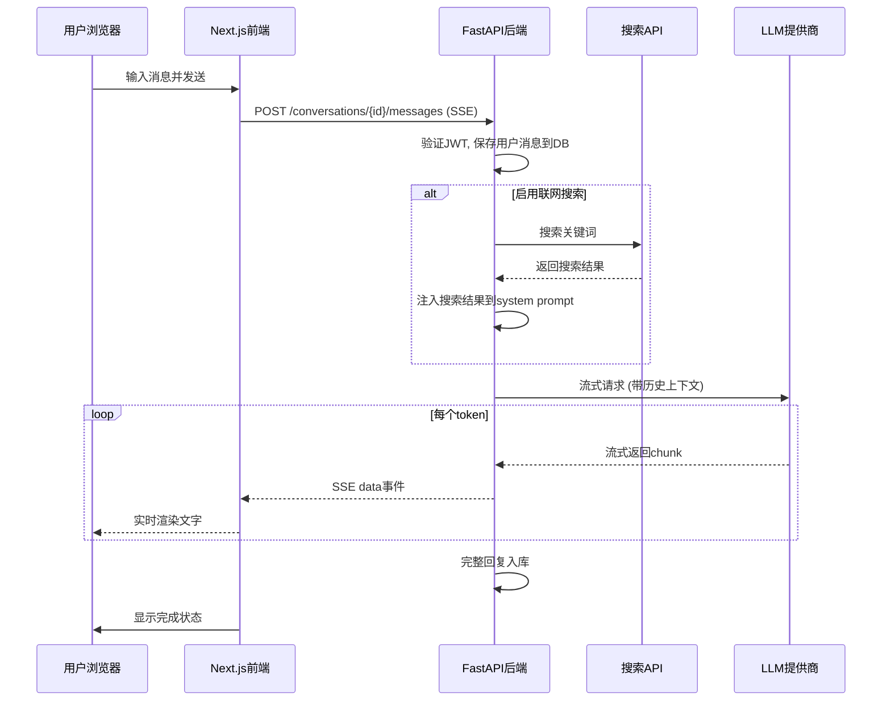

# 类 ChatGPT 对话问答系统 -- 全栈开发规划

## 整体架构



---

## 技术栈选择

### 前端

- **框架**: Next.js 14 (App Router) + TypeScript
- **UI 组件**: Tailwind CSS + shadcn/ui
- **状态管理**: Zustand (轻量)
- **Markdown 渲染**: react-markdown + rehype-highlight + remark-gfm
- **流式处理**: 原生 fetch + ReadableStream / EventSource (SSE)
- **HTTP 请求**: 原生 fetch (Next.js 内置优化)

### 后端

- **框架**: Python FastAPI
- **ORM**: SQLAlchemy 2.0 (async)
- **数据库**: PostgreSQL
- **缓存**: Redis (会话缓存 + 速率限制)
- **认证**: JWT (python-jose) + bcrypt
- **LLM 调用**: openai Python SDK (兼容 OpenAI 格式的各家 API 都可用此 SDK)
- **联网搜索**: Tavily API 或 SerpAPI
- **流式输出**: SSE (Server-Sent Events) via `StreamingResponse`

---

## 项目目录结构

```
chat_bot/
├── frontend/                    # Next.js 前端
│   ├── app/
│   │   ├── layout.tsx           # 根布局
│   │   ├── page.tsx             # 首页 -> 重定向到 /chat
│   │   ├── (auth)/
│   │   │   ├── login/page.tsx
│   │   │   └── register/page.tsx
│   │   └── chat/
│   │       ├── layout.tsx       # 聊天页布局(含侧栏)
│   │       ├── page.tsx         # 新对话
│   │       └── [id]/page.tsx    # 指定对话
│   ├── components/
│   │   ├── chat/
│   │   │   ├── ChatInput.tsx        # 输入框组件
│   │   │   ├── MessageList.tsx      # 消息列表
│   │   │   ├── MessageBubble.tsx    # 单条消息气泡
│   │   │   ├── ModelSelector.tsx    # 模型切换下拉
│   │   │   └── StreamingText.tsx    # 流式打字效果
│   │   ├── sidebar/
│   │   │   ├── ConversationList.tsx # 对话历史列表
│   │   │   └── Sidebar.tsx
│   │   ├── markdown/
│   │   │   └── MarkdownRenderer.tsx # Markdown + 代码高亮
│   │   └── ui/                      # shadcn/ui 组件
│   ├── lib/
│   │   ├── api.ts               # API 请求封装
│   │   ├── auth.ts              # 认证相关工具
│   │   └── stream.ts            # SSE 流式解析
│   ├── stores/
│   │   ├── chatStore.ts         # 对话状态
│   │   └── authStore.ts         # 认证状态
│   ├── package.json
│   ├── tailwind.config.ts
│   └── tsconfig.json
│
├── backend/                     # FastAPI 后端
│   ├── app/
│   │   ├── main.py              # FastAPI 入口
│   │   ├── config.py            # 配置管理
│   │   ├── database.py          # 数据库连接
│   │   ├── models/              # SQLAlchemy 模型
│   │   │   ├── user.py
│   │   │   ├── conversation.py
│   │   │   └── message.py
│   │   ├── schemas/             # Pydantic 请求/响应模型
│   │   │   ├── auth.py
│   │   │   ├── chat.py
│   │   │   └── message.py
│   │   ├── routers/             # API 路由
│   │   │   ├── auth.py          # 登录/注册/刷新Token
│   │   │   ├── chat.py          # 对话CRUD + 发送消息
│   │   │   └── models.py        # 可用模型列表
│   │   ├── services/            # 业务逻辑
│   │   │   ├── llm_service.py   # 多模型路由 + 流式调用
│   │   │   ├── search_service.py# 联网搜索
│   │   │   └── auth_service.py  # 认证逻辑
│   │   ├── middleware/
│   │   │   └── auth.py          # JWT 认证中间件
│   │   └── utils/
│   │       └── search.py        # 搜索结果格式化
│   ├── requirements.txt
│   ├── alembic/                 # 数据库迁移
│   └── alembic.ini
│
├── docker-compose.yml           # PostgreSQL + Redis
└── README.md
```

---

## Phase 1: 基础设施搭建

> **目标**: 前后端项目可启动, 数据库可连接, 开发环境就绪
> **交付物**: 可运行的前后端空壳 + Docker 容器化的 PostgreSQL / Redis

### Phase 1.1 -- 后端项目初始化

- 创建 `backend/` 目录结构
- 编写 `backend/requirements.txt` (fastapi, uvicorn, sqlalchemy, asyncpg, alembic, python-jose, bcrypt, openai, redis, pydantic-settings)
- 创建 `backend/app/main.py` -- FastAPI 应用入口, 注册 CORS 中间件
- 创建 `backend/app/config.py` -- 使用 pydantic-settings 管理环境变量
- 创建 `backend/app/database.py` -- 异步 SQLAlchemy 引擎 + SessionLocal

### Phase 1.2 -- Docker 环境

- 编写 `docker-compose.yml`, 包含:
  - PostgreSQL 15 (端口 5432, 持久化 volume)
  - Redis 7 (端口 6379)
- 创建 `.env` 文件模板 (DATABASE_URL, REDIS_URL, SECRET_KEY, 各 LLM API Key)

### Phase 1.3 -- 数据库模型 & 迁移

- 创建 SQLAlchemy 模型:
  - `backend/app/models/user.py` -- users 表 (id, username, email, hashed_password, created_at)
  - `backend/app/models/conversation.py` -- conversations 表 (id, user_id, title, model, created_at, updated_at)
  - `backend/app/models/message.py` -- messages 表 (id, conversation_id, role, content, created_at)
- 初始化 Alembic, 生成初始迁移脚本

### Phase 1.4 -- 前端项目初始化

- 使用 `npx create-next-app@latest` 创建 Next.js 项目 (TypeScript + App Router + Tailwind CSS)
- 安装并配置 shadcn/ui
- 创建基础页面路由骨架: `app/page.tsx`, `app/(auth)/login/page.tsx`, `app/chat/page.tsx`
- 配置 `next.config.js` 代理后端 API (rewrites 到 `localhost:8000`)

---

## Phase 2: 用户认证系统

> **目标**: 用户可以注册、登录, 受保护的 API 需要认证才能访问
> **交付物**: 完整的注册/登录流程, JWT 认证中间件

### Phase 2.1 -- 后端认证 API

**API 端点:**

- `POST /api/auth/register` -- 用户注册 (用户名 + 邮箱 + 密码)
- `POST /api/auth/login` -- 登录, 返回 access_token + refresh_token
- `POST /api/auth/refresh` -- 刷新 Token
- `GET /api/auth/me` -- 获取当前用户信息

**实现要点:**

- 密码使用 bcrypt 加盐哈希存储
- JWT Token: access_token 有效期 30 分钟, refresh_token 有效期 7 天
- refresh_token 存入 Redis, 支持主动注销
- 创建 `backend/app/middleware/auth.py` -- JWT 验证依赖项
- 创建 `backend/app/schemas/auth.py` -- 请求/响应 Pydantic 模型
- 创建 `backend/app/services/auth_service.py` -- 认证业务逻辑
- 创建 `backend/app/routers/auth.py` -- 路由注册

### Phase 2.2 -- 前端认证页面

- 创建 `frontend/stores/authStore.ts` -- Zustand 认证状态 (user, token, login, logout, register)
- 创建 `frontend/lib/api.ts` -- API 请求封装 (自动附加 JWT, 401 自动刷新 Token)
- 创建 `frontend/app/(auth)/login/page.tsx` -- 登录页面 (用户名/邮箱 + 密码)
- 创建 `frontend/app/(auth)/register/page.tsx` -- 注册页面
- 实现路由守卫: 未登录时重定向到 /login, 已登录时重定向到 /chat
- 前端将 token 存储在 httpOnly cookie 中 (防 XSS)

---

## Phase 3: 核心对话功能

> **目标**: 用户可以发送消息并收到 AI 的流式回复, 对话可持久化
> **交付物**: 单模型可用的端到端对话链路 (含 SSE 流式输出)

### Phase 3.1 -- 后端对话 API + LLM 服务

**对话 CRUD API:**

- `GET /api/conversations` -- 获取用户的对话列表
- `POST /api/conversations` -- 创建新对话
- `GET /api/conversations/{id}` -- 获取对话详情 + 消息历史
- `DELETE /api/conversations/{id}` -- 删除对话
- `PATCH /api/conversations/{id}` -- 重命名对话

**消息发送 API (SSE 流式):**

- `POST /api/conversations/{id}/messages` -- 发送消息, 返回 SSE 流

**LLM 服务 (`backend/app/services/llm_service.py`):**

```python
from fastapi.responses import StreamingResponse

async def stream_chat(conversation_id, user_message, model):
    async def event_generator():
        async for chunk in llm_service.stream_completion(messages, model):
            yield f"data: {json.dumps({'content': chunk})}\n\n"
        yield "data: [DONE]\n\n"
    return StreamingResponse(event_generator(), media_type="text/event-stream")
```

**实现要点:**

- 先接入单个 LLM (如 DeepSeek), 使用 openai SDK + `base_url` 参数
- 用户消息立即入库, AI 回复在流式输出完成后整条入库
- 上下文窗口: 取最近 20 条消息作为上下文

### Phase 3.2 -- 前端流式对话

- 创建 `frontend/lib/stream.ts` -- SSE 流式解析工具

```typescript
export async function streamChat(conversationId: string, message: string) {
  const response = await fetch(`/api/conversations/${conversationId}/messages`, {
    method: 'POST',
    body: JSON.stringify({ content: message }),
  });
  const reader = response.body!.getReader();
  const decoder = new TextDecoder();
  while (true) {
    const { done, value } = await reader.read();
    if (done) break;
    const text = decoder.decode(value);
    // 解析 SSE data 行, 逐步更新 UI
  }
}
```

- 创建 `frontend/stores/chatStore.ts` -- Zustand 对话状态 (conversations, messages, currentConversation, sendMessage)
- 创建简单的 ChatInput 组件, 验证端到端流式通信可用

---

## Phase 4: 前端 UI 完善

> **目标**: 构建完整的、美观的聊天界面, 接近 ChatGPT 的体验
> **交付物**: 完整的对话 UI (消息气泡 + 侧栏 + Markdown 渲染)

### Phase 4.1 -- 聊天界面核心组件

- `frontend/components/chat/MessageBubble.tsx` -- 单条消息气泡 (区分 user / assistant 样式)
- `frontend/components/chat/MessageList.tsx` -- 消息列表, 自动滚动到底部
- `frontend/components/chat/ChatInput.tsx` -- 输入框 (支持 Shift+Enter 换行, Enter 发送, 发送中禁用)
- `frontend/components/chat/StreamingText.tsx` -- 流式打字效果 + 光标动画
- `frontend/app/chat/page.tsx` -- 新对话页面
- `frontend/app/chat/[id]/page.tsx` -- 指定对话页面

### Phase 4.2 -- 侧栏对话列表

- `frontend/components/sidebar/Sidebar.tsx` -- 侧栏容器 (可折叠)
- `frontend/components/sidebar/ConversationList.tsx` -- 对话历史列表 (按时间分组: 今天/昨天/更早)
- `frontend/app/chat/layout.tsx` -- 聊天页布局 (左侧栏 + 右侧聊天区)
- 支持: 新建对话、删除对话、重命名对话、点击切换对话

### Phase 4.3 -- Markdown 渲染 & 代码高亮

- `frontend/components/markdown/MarkdownRenderer.tsx`:
  - 使用 `react-markdown` + `remark-gfm` (支持表格、任务列表等)
  - 使用 `rehype-highlight` 或 `react-syntax-highlighter` 实现代码块语法高亮
  - 代码块增加「复制」按钮
  - 支持 LaTeX 公式渲染 (可选, 使用 `rehype-katex`)
- 将 MarkdownRenderer 集成到 MessageBubble 中, AI 回复以 Markdown 格式渲染

---

## Phase 5: 多模型切换

> **目标**: 用户可以在多个 LLM 提供商之间自由切换
> **交付物**: 模型选择器 UI + 后端多模型路由

### 后端

- 扩展 `backend/app/services/llm_service.py` -- 多模型路由器:

```python
MODELS = {
    "gpt-4o": {"provider": "openai", "base_url": "https://api.openai.com/v1", "api_key": "..."},
    "deepseek-chat": {"provider": "deepseek", "base_url": "https://api.deepseek.com", "api_key": "..."},
    "glm-4-plus": {"provider": "zhipu", "base_url": "https://open.bigmodel.cn/api/paas/v4", "api_key": "..."},
}
```

- 创建 `backend/app/routers/models.py` -- `GET /api/models` 返回可用模型列表
- 对话创建时绑定所选模型, 对话内可切换模型

### 前端

- 创建 `frontend/components/chat/ModelSelector.tsx` -- 模型切换下拉菜单
- 在 ChatInput 上方或侧栏中显示当前模型, 支持切换
- 每个对话记录所使用的模型

---

## Phase 6: 联网搜索

> **目标**: AI 回答时可以引用最新的网络信息
> **交付物**: 可开关的联网搜索功能

### 后端

- 创建 `backend/app/services/search_service.py`:

```python
async def search_web(query: str) -> str:
    results = tavily_client.search(query, max_results=5)
    formatted = "\n".join([f"[{r['title']}]({r['url']}): {r['content']}" for r in results])
    return f"以下是搜索结果:\n{formatted}\n\n请基于以上信息回答用户问题。"
```

- 在消息处理流程中集成搜索: 用户消息 -> 判断是否需要搜索 -> 搜索 -> 注入 system prompt -> LLM 生成
- 支持通过请求参数 `enable_search: boolean` 控制是否启用

### 前端

- 在 ChatInput 区域添加「联网搜索」开关按钮
- AI 回复中引用的搜索来源以链接形式展示

---

## Phase 7: 优化打磨

> **目标**: 提升用户体验, 处理边界情况, 达到可用产品水准
> **交付物**: 完善的错误处理、加载状态、响应式布局

### 功能优化

- **自动标题生成**: 第一条消息发送后, 用 LLM 异步生成对话摘要标题
- **上下文窗口管理**: 根据模型的 token 上限动态截断历史消息
- **停止生成**: 用户可中途停止 AI 的流式输出
- **重新生成**: 对 AI 的最后一条回复重新生成

### 体验优化

- **加载动画**: 发送消息后显示 "AI 思考中" 动画
- **错误处理**: 网络错误、API 限流、Token 过期等场景的友好提示
- **响应式布局**: 移动端适配 (侧栏抽屉式展开)
- **深色模式**: 基于 Tailwind CSS dark mode 实现明/暗主题切换
- **键盘快捷键**: Ctrl+N 新建对话, Ctrl+Shift+S 切换侧栏等

---

## 数据流: 用户发送消息的完整链路



---

## 里程碑总览

```mermaid
gantt
    title 开发阶段里程碑
    dateFormat X
    axisFormat %s

    section Phase1
    后端项目初始化          :p1a, 0, 1
    Docker环境配置          :p1b, 0, 1
    数据库模型与迁移        :p1c, after p1a, 1
    前端项目初始化          :p1d, 0, 1

    section Phase2
    后端认证API             :p2a, after p1c, 1
    前端认证页面            :p2b, after p1d, 1

    section Phase3
    后端对话API与LLM服务    :p3a, after p2a, 2
    前端流式对话            :p3b, after p2b, 2

    section Phase4
    聊天界面核心组件        :p4a, after p3b, 2
    侧栏对话列表            :p4b, after p3b, 1
    Markdown渲染            :p4c, after p4a, 1

    section Phase5
    多模型切换              :p5, after p4c, 1

    section Phase6
    联网搜索集成            :p6, after p5, 1

    section Phase7
    优化打磨                :p7, after p6, 2
```



